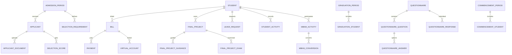

# ERD Konseptual (MVP + Core Campus)

## Domain Inti Akademik

```mermaid
erDiagram
  UNIVERSITY ||--o{ FACULTY : has
  FACULTY ||--o{ STUDY_PROGRAM : has

  ROLE ||--o{ USER : assigned
  ROLE ||--o{ ROLE_PERMISSION : grants
  PERMISSION ||--o{ ROLE_PERMISSION : maps

  USER ||--o| STUDENT : profile
  USER ||--o| LECTURER : profile
  USER ||--o{ AUDIT_LOG : writes

  STUDY_PROGRAM ||--o{ STUDENT : owns
  STUDY_PROGRAM ||--o{ CURRICULUM : owns
  CURRICULUM ||--o{ CURRICULUM_COURSE : contains
  COURSE ||--o{ CURRICULUM_COURSE : referenced
  COURSE ||--o{ COURSE_PREREQUISITE : prerequisite
  COURSE ||--o{ COURSE_EQUIVALENCE : equivalent

  ACADEMIC_YEAR ||--o{ ACADEMIC_PERIOD : has
  STUDY_PROGRAM ||--o{ CLASS : opens
  COURSE ||--o{ CLASS : taught
  CLASS ||--o{ CLASS_SCHEDULE : scheduled
  CLASS ||--o{ CLASS_LECTURER : taught_by
  CLASS ||--o{ MEETING : has
  MEETING ||--o{ ATTENDANCE : records

  STUDENT ||--o{ CLASS_STUDENT : enrolled
  CLASS ||--o{ CLASS_STUDENT : has
  CLASS_STUDENT ||--o{ GRADE : has

  STUDENT ||--o{ STUDY_PLAN : submits
  ACADEMIC_PERIOD ||--o{ STUDY_PLAN : references
  STUDY_PLAN ||--o{ STUDY_PLAN_ITEM : has
  CLASS ||--o{ STUDY_PLAN_ITEM : chosen

  STUDENT ||--o{ KHS : receives
  ACADEMIC_PERIOD ||--o{ KHS : for_period
  STUDENT ||--o{ TRANSCRIPT : cumulative

  STUDENT ||--o{ STUDENT_PARENT : has
  STUDENT ||--o{ ACADEMIC_ADVISOR : assigned
  LECTURER ||--o{ ACADEMIC_ADVISOR : advises
  STUDENT ||--o{ CONSULTATION : initiates
  LECTURER ||--o{ CONSULTATION : responds
```

## Domain Pendukung (Gelombang 2+)



## Catatan Kardinalitas Penting
- Satu mahasiswa bisa punya banyak KRS (`study_plans`) lintas periode.
- Satu KRS punya banyak item kelas, tapi satu kombinasi kelas-mahasiswa unik per periode.
- Nilai resmi ke KHS/transkrip hanya berasal dari grade yang `isLocked = true`.
- Semua aksi sensitif harus menghasilkan baris `audit_logs`.
